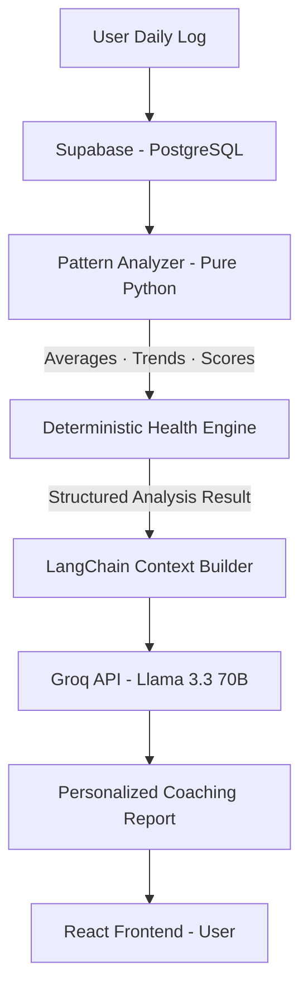

<div align="center">

<br/>


<br/>

**AI-Powered Personal Health Coaching System with Deterministic Pattern Analysis & LLM Interpretation**

*Built on a clean separation between data computation and language generation — the LLM interprets, never calculates.*

<br/>

[](https://your-app.vercel.app)
[](https://python.org)
[](https://react.dev)
[](https://fastapi.tiangolo.com)
[](#)

<br/>

</div>

---

## 📸 Application Interface

<p align="center">
  
</p>

<p align="center">
  
  &nbsp;
  
</p>

*Main system interface showing the health dashboard with radar analysis, alongside the AI chat coach and daily log form.*

---

## 🔗 Live Demo

You can access the live application here:
**[AI Health Coach — Live App](https://your-app.vercel.app)**

> **Note:** Optimized for **Desktop display**. For the best experience, use a desktop browser.

---

## 📌 Project Overview

AI Health Coach is a full-stack personal wellness system that tracks daily habits, detects behavioral patterns, and delivers AI-generated coaching reports — all grounded in the user's own data.

The system combines two data layers:

1. **User-Generated Data**
   Structured daily logs stored in Supabase (PostgreSQL) — sleep, hydration, exercise, mood, and stress levels tracked over time.

2. **AI Interpretation Layer**
   - Deterministic pattern analysis engine (pure Python — no LLM involved in math)
   - Groq API (Llama 3.3-70B) for personalized coaching language
   - LangChain for conversation history and context management

The system detects health anomalies, decomposes habit patterns, and produces coaching conclusions accompanied by **data-backed evidence** — enabling full user transparency (*human-in-the-loop*).

---

## 🏗️ System Architecture

The pipeline enforces a strict **computation-first, interpretation-second** flow to prevent LLM hallucination on numerical health data.



---

## 🔄 Pipeline Explanation

1. **Daily Log Input**
   User submits 5 health metrics via a clean React form — sleep hours, water intake, exercise duration, mood score, and stress level.

2. **Persistent Storage**
   All logs are stored in Supabase (PostgreSQL) with indexed schema for efficient time-series retrieval.

3. **Deterministic Pattern Analyzer**
   Pure Python engine computes averages, 7–14 day trends, per-metric health scores (0–100), and identifies weak/strong areas. **Zero LLM involvement** at this stage.

4. **Context-Aware LLM Synthesis**
   The structured analysis is passed to Llama 3.3-70B via Groq API. The model receives pre-computed facts and only generates human language — it never performs calculations.

5. **Coaching Output**
   Final report separates observed data, computed scores, and inferred coaching advice by epistemic category.

6. **Interactive Chat**
   Users continue the conversation with the coach. Every reply is anchored to the user's actual health data context.

---

## ✅ System Advantages

1. **Deterministic First, LLM Second**
   All numerical computation happens in Python before any LLM is invoked. This eliminates hallucinated health scores or fabricated statistics.

2. **Epistemic Transparency**
   The system explicitly separates three information layers:
   - **Observed** — raw numbers directly from user logs
   - **Computed** — scores and trends from the Python analyzer
   - **Inferred** — coaching language generated by the LLM

3. **Context-Grounded Coaching**
   Every response is anchored to the user's actual weak areas, strong areas, and trend direction — not generic wellness templates.

4. **Anti-Hallucination Architecture**
   The LLM receives a structured prompt of pre-verified facts only. It is explicitly instructed to interpret, never to calculate.

---

## ⚙️ Key Features

### 1. Deterministic Health Scoring Engine
- **Trend Detection** — identifies improving ↑, declining ↓, or stable → patterns across 7–14 days
- **Per-Metric Scoring** — scores each habit area 0–100 against evidence-based ideal thresholds
- **Weakness Surfacing** — automatically highlights areas most in need of attention

### 2. AI Weekly Report Generation
- **Habit Decomposition** — breaks overall wellness score into contributing factors
- **Personalized Language** — coaching tone adapts to the user's real data profile, not templates
- **Actionable Output** — 3 specific, realistic recommendations generated per session

### 3. Interactive Chat Coach
- **Persistent Context** — last 8 messages retained as conversation history
- **Data-Aware Responses** — every reply informed by current health scores and trends
- **Domain Governance** — coach gracefully declines off-topic requests

### 4. Visual Analytics Dashboard
- Radar chart for full health profile overview
- Mood vs. Stress trend line comparison
- Habit vs. ideal target bar chart
- Real-time score cards with trend direction badges

---

## 🛠️ Tech Stack

| Layer | Technology | Role |
|---|---|---|
| 🧠 LLM | Groq API · Llama 3.3-70B | Coaching language generation |
| 🔗 Orchestration | LangChain | Message history & prompt management |
| 🗄️ Database | Supabase (PostgreSQL) | Logs, chat history, user profiles |
| ⚙️ Backend | FastAPI + Uvicorn | REST API & business logic |
| ⚛️ Frontend | React 18 + Vite | UI, routing, state management |
| 📊 Charts | Recharts | Interactive data visualizations |
| 🎨 Styling | Tailwind CSS | Clean, minimal design system |
| ☁️ Deploy | Vercel + Railway | Frontend + Backend hosting |

**Total infrastructure cost: $0/month** — 100% free tiers.

---

## 📁 Project Structure

```
health-coach-ai/
│
├── backend/                        ← FastAPI (Python)
│   ├── main.py                     ← API entry point + CORS
│   ├── requirements.txt
│   ├── routers/
│   │   ├── logs.py                 ← POST/GET daily logs
│   │   ├── analytics.py            ← GET pattern analysis
│   │   └── coach.py                ← AI report + chat endpoints
│   └── src/
│       ├── llm/coach.py            ← Groq + LangChain integration
│       ├── database/               ← Supabase client & operations
│       └── analysis/               ← Deterministic scoring engine
│
└── frontend/                       ← React + Vite + Tailwind
    └── src/
        ├── App.jsx                 ← Sidebar layout + routing
        ├── lib/api.js              ← Axios API client
        └── pages/
            ├── LogPage.jsx         ← Daily habit logging form
            ├── DashboardPage.jsx   ← Charts + AI weekly report
            └── ChatPage.jsx        ← Interactive AI chat
```

---

## 🚀 Quick Start

### Prerequisites
- Python 3.10+, Node.js 18+
- Groq API key → [console.groq.com](https://console.groq.com) *(free)*
- Supabase project → [supabase.com](https://supabase.com) *(free)*

### Backend
```bash
cd backend
python -m venv venv && venv\Scripts\activate
pip install -r requirements.txt
cp .env.example .env        # Fill GROQ_API_KEY, SUPABASE_URL, SUPABASE_KEY
uvicorn main:app --reload --port 8000
```

### Database
```sql
-- Paste data/supabase_schema.sql into Supabase → SQL Editor → Run
```

### Frontend
```bash
cd frontend
npm install
cp .env.example .env        # Set VITE_API_URL=http://localhost:8000
npm run dev
```

Open **http://localhost:5173** ✅

---

## 🌐 Deployment

| Service | Platform | Free Tier |
|---|---|---|
| Frontend | [Vercel](https://vercel.com) | Unlimited hobby projects |
| Backend | [Railway](https://railway.app) | $5/month free credits |
| Database | [Supabase](https://supabase.com) | 500MB · 2 projects |

---

## ⚠️ Scope & Limitations

- Designed for **personal use and portfolio demonstration**
- Not a medical device — does not provide clinical diagnosis
- Currently optimized for **single-user mode** (no authentication layer)
- Coaching quality improves with consistent daily logging — minimum 3 days recommended

---

## 🙋 About This Project

This project was built to demonstrate practical skills in:

- **LLM Application Architecture** — designing a system *around* an LLM, not just calling one
- **Epistemic Engineering** — enforcing strict separation between computation and interpretation
- **Full-Stack Development** — FastAPI backend + React frontend with clean REST API contracts
- **Production Mindset** — environment management, error handling, modular codebase, CI/CD deployment

---

## 📄 License

MIT License — free to fork, modify, and build upon.

---

<div align="center">
  <br/>
  <sub>Built by <a href="https://github.com/YOUR_USERNAME">Your Name</a> · <a href="https://linkedin.com/in/YOUR_PROFILE">LinkedIn</a> · <a href="https://your-app.vercel.app">Live Demo</a></sub>
  <br/><br/>
  <sub>Powered by Groq · LangChain · Supabase · React · FastAPI</sub>
</div>
